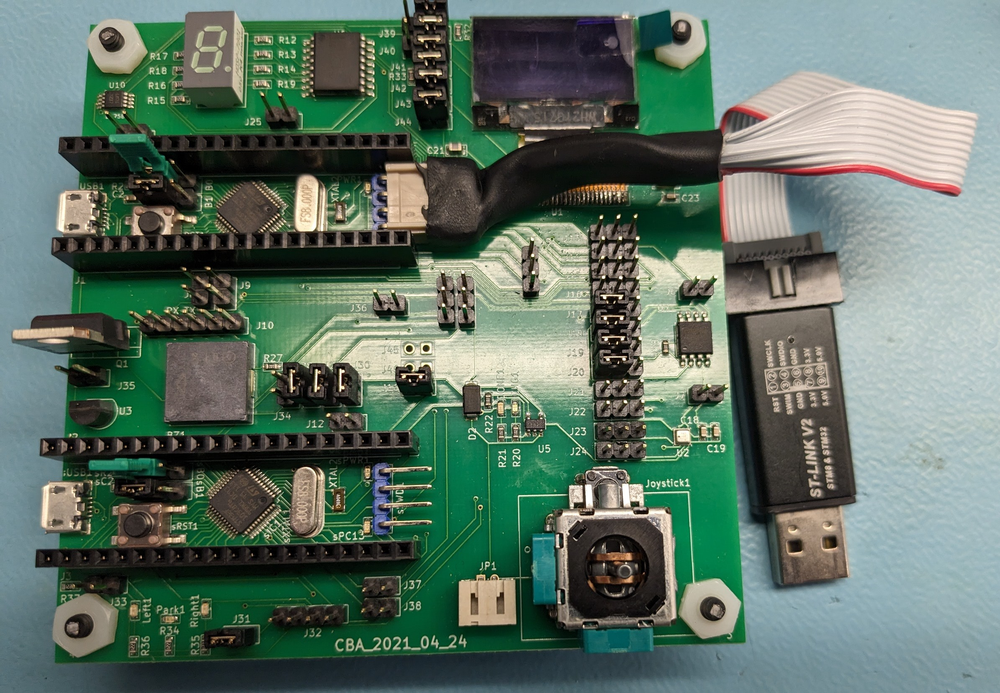

# Getting started with CBA_2021_04_24
1. Boot computer and login
2. On school computers use https://myapps.humber.ca/labs (otherwise [Windows](https://www.arduino.cc/en/Guide/Windows), [Linux](https://www.arduino.cc/en/Guide/linux) or [Mac](https://www.arduino.cc/en/Guide/MacOSX) instructions)
3. Launch Arduino IDE (it ends up being version 1.8.19 on school computers)
4. Click on "File" menu and then "Preferences".
5. The "Preferences" dialog will open, then add the following link to the "Additional Boards Managers URLs" field:
   http://dan.drown.org/stm32duino/package_STM32duino_index.json   
    
6. Click "Ok"
7. Click on "Tools" menu and then "Boards > Boards Manager"   
    
8. The board manager will open and you will see a list of installed and available boards.
9. Select "Contributed" type.
10. Scroll down and select the "STM32F1xx" and click on install.   
    
11. After installation is complete an "INSTALLED" tag appears next to the core name.
12. You can close the Board Manager.
13. For the [STLink Utility](https://www.st.com/content/st_com/en/products/development-tools/software-development-tools/stm32-software-development-tools/stm32-programmers/stsw-link004.html) and the [STLink Driver](https://www.st.com/content/st_com/en/products/development-tools/software-development-tools/stm32-software-development-tools/stm32-utilities/stsw-link009.html) you will need to create a free account to download and install them. Do so as long as you find the license agreements, etc. acceptable.   
    
15. Install the STM32 ST-LINK Utility via STM32 ST-LINK Utility v4.2.0 setup.exe and click on Next >   
    
16. Select Yes as long as you find the license agreements, etc. acceptable.   
    
17. Confirm the Destination Location Next >   
    
18. Click on Finish:   
    
19. Proceed with the device driver installation Next >   
    
20. Confirm that you would like to install the device software:   
    
21. Click on Finish:   
    
22. For the driver notice that the readme.txt says "To install the driver, run stlink_winusb_install.bat in administrator mode, before connecting any ST-Link to the PC." So run the stlink_winusb_install batch file:   
    
23. Proceed with the device driver installation Next >   
    
24. Confirm that you would like to install the device software:   
    
25. Click on Finish:   
    
26. Download the [STM32duino drivers](https://github.com/rogerclarkmelbourne/Arduino_STM32/):   
    
27. Extract the download:   
    
28. Keep the download:   
    
29. Install the drivers:   
    
30. Press any key to continue . . .    (Some patience is needed with install_drivers.bat for the Maple DFU)   
    
31. Install the COM driver:   
    
32. Press any key to continue . . .    
    
33. In Arduino IDE you can find the STM32 boards package in the "Board" menu. Select the desired boards series:   
    
34. Select Tools -> Upload methods -> STLink Depending of the board, several upload methods could be proposed, thanks the "Tools > Upload Method" menu.   
       
35. Connect the ST LINK V2 or similar to the board. Then plug the ST LINK V2 or similar into the computer.   
    
    On a generic blue pill (note that the pinouts on ST LINK V2 clones are not all the same):   
       
37. Select the blink example:   
    
38. If it says ```LED_BUILTIN```, that should work since it is mapped to ```PC13```   
    
39. If it appears with code to blink pin ```13```, we'll need to specify that it is on Port C by adding PC in front of the 13:   
    
40. Click on upload:    
    
41. If sucessfully uploaded the application should start and the green LED should blink at the rate controlled by the code.   
    
42. This STM32F103 microcontroller based platform
provides a Serial Peripheral
Interface (SPI) for an onboard OLED and SDcard socket, a one wire
DS18B20 temperature sensor, redundant Inter-Integrated Circuit (I2C)
LM75 temperature, BME280 environment, W25Q64JVDAIM flash
and PCF8574 I/O expansion chips, a segmented and other indicator LEDs,
an analog joystick, battery and a connector for a servo. As such the plan is for this document to provide more examples in the future, ideally to easily test the OLED.
43. This platform is deprecated due to STM32 shortages and OLED reliability issues. We have moved to a RP2040 platform.
44. Both BOOT jumpers are on the 0 side (versus 1).   
[On very rare occasions uploading fails. In this situation I have to move BOOT0 jumper to 1 and upload the sketch. Binaries do not run when BOOT0 is set to 1 therefore I move it back. There are also very rare occasions when blue pill does not reset after upload. I have to push the reset button.](https://www.onetransistor.eu/2017/11/stm32-bluepill-arduino-ide.html)
45. J Headers - isolation of almost every component should be possible, note that uSD disconnect is simply removing the card:   
	0. CANmain/I2Cmaster/STLinkTarget STM32   
	1. CANmain/I2Cmaster/STLinkTarget STM32   
	2. CANrear/I2Cslave/STLink STM32   
	3. CANrear/I2Cslave/STLink STM32   
	4. PCF8574, Joystick, 7 Segment disconnect   
	5. Servo pin header   
	6. Flash disconnect   
	7. BME disconnect   
	8. Flow control disconnect   
	9. Flow control disconnect   
	10. Programming port/for serial TTL cable   
	11. Inter STM32 3.3V disconnect   
	12. STLink voltage divider disconnect   
	13. MOSIsd   
	14. MISOsd   
	15. SCKsd   
	16. NSSsd   
	17. MOSIflash   
	18. MISOflash   
	19. SCKflash   
	20. NSSflash   
	21. MOSIbme   
	22. MISObme   
	23. SCKbme   
	24. NSSbme   
	25. PCF8574 Interrupt disconnect   
	26. PCF8574 SDA choice   
	27. PCF8574 SCL choice   
	28. CAN disconnect   
	29. CAN disconnect   
	30. CAN disconnect   
	31. CAN LEDs power disconnect   
	32. STLink header   
	33. STLink R37 disconnect   
	34. STLink NRST disconnect   
	35. DS18B20 disconnect   
	36. TTL3.3V disconnect   
	37. SDAslave disconnect   
	38. SCLslave disconnect   
	39. LM75-OLED DC   
	40. LM75-OLED RST   
	41. OLED MOSI   
	42. OLED SCK   
	43. OLED NSS   
	44. OLED 3.3V   
	45.   
	46.     
